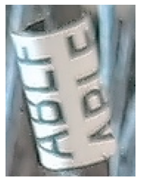
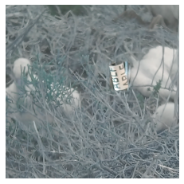
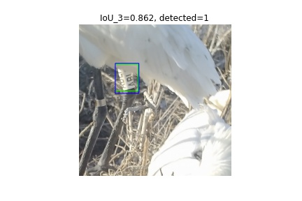
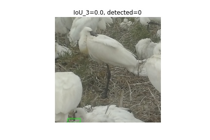

# spatule-tags-tf2-object-detection-api

## Acknowledgements

Jocelyn Champagnon, researcher at Tour du Valat, for providing us with the data.

Cédric Pradalier, Associate Professor at Georgia Tech, and Aishwarya Venkataramanan, PhD. student, for their weekly support


## Prerequisites
* requirements.txt (numpy version, < 1.19, tf version 2.4 ...etc, packages versions)
* python 3.6.9 (with venv)
* GPU 1080 Ti, k20c
* labelImg: for hand labeling datasets

## Data & problem explanation
In the south of France, and in other collaborating European countries, scientists are studying birds called spatules. To better understand their behaviours such as their migrations, they have attached tags on their legs with a unique identification sequence of characters. They have also set cameras on the field which take pictures regularly (every 10 minutes). Until now, they have extracted data from these images by hand. 


.JPG)

The objective of the project is to perform object detection to locate the tags on images. An important second step will be to read the tags, but it is not tackled here.

The tags have a common pattern. They are made of 4 black letters or digits on a white background, with a specific font. Some letters and digits are removed to avoid confusion between similar ones (for example E is removed because it looks too much like F).


The main problem we faced is that there are too few tags in real data. Most of the time, birds in the pictures do not have a tag, or it is hidden by other birds or because they are sitting. We also didn’t want to hand-label thousands of images.


## Synthetic data generation

To overcome this issue, we proceeded to synthetic data generation. To do so, we had explored various techniques, such as making completely artificial tags or alpha blending real tags on other images. In the end, the best way we found is to use seamless cloning.

To do so, we still had to hand-label some images. We used the labelImg library to annotate some images. From there, we extracted some real tags. We combined them with images from our annotated images which we know do not contain tags, referred as background. The combining technique is called seamless cloning and is implemented in Python's OpenCV library. It basically allowed us to “paste” real tags on background smoothly by masking all background of the real tags image.





We choose a random location to paste the tag on the background so it is easy to automatically create annotations in the XML format (Pascal VOC format). The original images’ sizes are about 4000x3000. However, the object detection model we will use takes 640x640 images as inputs. So, we crop the background to match this size. The tags’ sizes are not changed.

Another issue we faced, is that we did not want the model to recognize the letters and digits in the tags but the general pattern of tags. To make sure of it in the evaluation phase, we separate tags from the training and testing dataset.

include sample synth data
seamless cloning
separating eval and train tags 

## Training

Our training dataset is made of 60% of images containing a tag (see above) and 40% without tag and contains a total of 5,000 images.
Before running training, we need to run the `generate_tfrecord.py` script in order to convert the XML files into TF records readable by the API.

```
$ python generate_tfrecord.py -x path/to/images/train -l path/to/annotations/label_map.pbtxt -o path/to/annotations/train.record
```
To perform training we used Google’s Object Detection API.
The structure of the training folder should be like:
```
.
├── annotations
│   ├── label_map.pbtxt
│   ├── test.record
│   └── train.record
├── exported-models
├── images
│   ├── test
│   └── train
├── model_main_tf2.py
├── models
│   └── my_ssd_resnet50_v1_fpn
│       └── pipeline.config
└── pre-trained-models
    └── ssd_resnet50_v1_fpn_640x640_coco17_tpu-8
        ├── checkpoint
        │   ├── checkpoint
        │   ├── ckpt-0.data-00000-of-00001
        │   └── ckpt-0.index
        ├── pipeline.config
        └── saved_model
            ├── assets
            ├── saved_model.pb
            └── variables
                ├── variables.data-00000-of-00001
                └── variables.index

```
In the `/images/train` and `/images/test` files, we can add our .jpg and the corresponding xml files.


In pipeline.config
* To set the batch_size:
```
train_config {
  batch_size: 1
  ...
  }

```

* To set the checkpoints folder:
```
  fine_tune_checkpoint: "./pre-trained-models/ssd_resnet50_v1_fpn_640x640_coco17_tpu-8/checkpoint/ckpt-0"
```


* If there is only one class on label_map.pbtxt, set the type as "detection" 
```
  fine_tune_checkpoint_type: "detection"
```
* To set the input path (Use relative path)
```
train_input_reader {
  label_map_path: "./annotations/label_map.pbtxt"
  tf_record_input_reader {
    input_path: "./annotations/train.record"
  }
}
eval_config {
  metrics_set: "coco_detection_metrics"
  use_moving_averages: false
}
eval_input_reader {
  label_map_path: "./annotations/label_map.pbtxt"
  shuffle: false
  num_epochs: 1
  tf_record_input_reader {
    input_path: "./annotations/test.record"
  }
}
```

* To set the num of steps
```
total_steps: 5000
```

## Results/Evaluation
custom evaluation process

In pipeline.config, set the `path/to/test.record` like above. Run evaluation after training.
For example, run evaluation every 5k steps and launch TensorBoard to see the results.

Since the evaluation tools of the Object Detection API are not very practical, we have developped our own evaluation script: `custom_evaluation.py`. It can be run from the root of the training folder. It opens the latest checkpoint in the models/my_ssd_resnet50_v1_fpn folder. It runs detections on the images/test folder and uses the XML files to get the ground truth labels.

For each image, it computes the IoU and the areas of the bounding boxes for detections at two different threshold .3 and .7. It finally outputs a CSV `eval_test.csv` file which contains the metrics for each image.

We ran this custom evaluation on all the labelled data that we have (although the model was trained on synthetic data). We first had to cut the original images into 640x640 images. It resulted in an overall average IoU of 0.95 and specifically on images that contain a tag (a vast minority of the data) have an average IoU of 0.60. This number is essentially pulled down by images that have cut tags as you can see below In green are the ground truth labels, and in blue the detections at threshold 0.3.




### To connect from local computers
```
$ ssh -L Localport:127.0.0.1:GPUport path/to/GPU
```
On local computers: go to localhost:Localport


## Important links
* TF object detction api: https://tensorflow-object-detection-api-tutorial.readthedocs.io/en/latest/index.html
* TF repo: https://github.com/tensorflow/tensorflow
* LabelImg: https://github.com/tzutalin/labelImg
* cocoAPI: https://github.com/cocodataset/cocoapi

## Future work
## Credits
This project was carried by Valerie Lin and Antoine Rollet, Master students in CS at Georgia Tech
